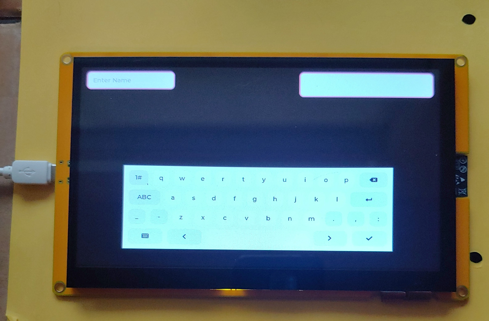

# Rust ESP32S3 Lvgl Keyboard

The purpose of this demo is to use lv-binding-rust (Lvgl) and use the keyboard as text entry into two different text areas.

## Development Board
Aliexpress ESP32-8048S070 - 7 inch 800x400 TN RGB with ESP32S3, 8M PSRAM, 16M Flash, 512KB SRAM

## Overview
This application uses the lv-binding-rust crate on a ESP32S3 device.  The program will display a keyboard and two text areas.  The one on the top left is a single line text area.  The keyboard is focused on this text area when first powered up.  The 2nd text area is bigger can can accept multiple lines but can only show two lines at a time.

## Comment
See rust-esp32s3-lvgl-clickme project for details on individual folders and files.

I could not get the event LV_EVENT_READY to work which indicates that the check mark key on keyboard has been pressesd and released.  The check mark key indicates that user has finished adding text to the text area.  It looks like lv-binding-rust does not support that event yet.

## Flashing the ESP32S3 device
I used the following command to flash the ESP32S3 device.
```
$ cargo espflash flash --partition-table=partition-table/partitions.csv --monitor
```

## Picture of Aliexpress ESP32S3 running keyboard app



# Versions
### v1.0 : 
- initial release
